# Chapter 1: The Core Workflow (Modules 01-05)

This section covers the absolute fundamentals: creating repos, the specific rules of adding/committing, viewing history, and file management.

## 1. Setup & Configuration (Module 03)

Before you type a single command, ensure your environment is set.

### Global vs. Local Config

Git has three levels of config: System, Global (User), and Local (Project).

* **Check your config:** `git config --list`
* **Edit your config:** `git config --global --edit`

**The Essential Commands:**

```bash
# Identity (Required for commits)
git config --global user.name "Your Name"
git config --global user.email "you@example.com"

# Editor (Vim is default, change it if you hate it)
git config --global core.editor "code --wait" 

# Line Endings (CRLF vs LF)
# Windows:
git config --global core.autocrlf true
# Mac/Linux:
git config --global core.autocrlf input

```
<!-- 
> **Visual Reference:** See **`001 03 - Installation & Setup.pdf`** (Pages 12-14) for the specific syntax on setting user identity. -->

---

## 2. The Repository & The 3 States (Module 04)

### Initialization

```bash
git init

```

This creates the hidden `.git` folder.

* **Crucial Concept:** If you delete the `.git` folder, your project is no longer a Git repo. You lose all history, but your current files remain.

### The Three States (The "Area" Model)

You cannot understand `git add` without this.

1. **Working Directory:** The files you see in your folder.
2. **Staging Area (Index):** The "waiting room" for the next commit.
3. **Repository:** The committed history.

---

## 3. The Commit Cycle: Status, Add, Commit (Module 04)

### Inspection (`git status`)

Run this before *every* other command.

```bash
git status

```

* **Untracked:** Git sees the file but isn't tracking it.
* **Modified:** Git tracks it, and it has changed since the last commit.
* **Staged:** Ready to be committed.

### Staging (`git add`)

The command `git add` moves changes from **Working Directory**  **Staging Area**.

```bash
# Stage a specific file
git add index.html

# Stage multiple specific files
git add index.html style.css

# Stage EVERYTHING in the current directory (New, Modified, and Deleted files)
git add .

```

### Committing (`git commit`)

Moves changes from **Staging Area**  **Repository**.

```bash
# Standard commit (opens your default text editor for the message)
git commit

# Inline message (faster, for short messages)
git commit -m "Fix login bug"

```
<p align="center">
  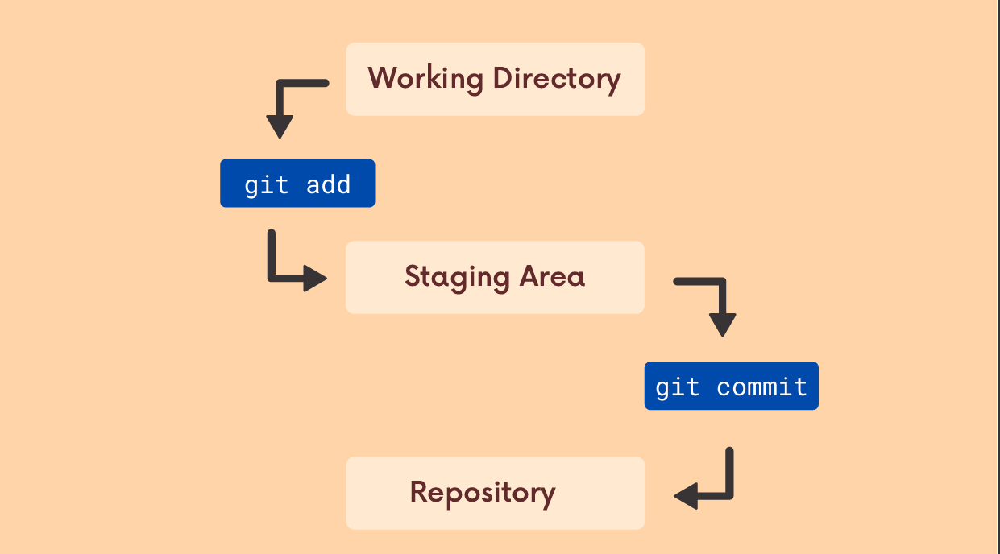
  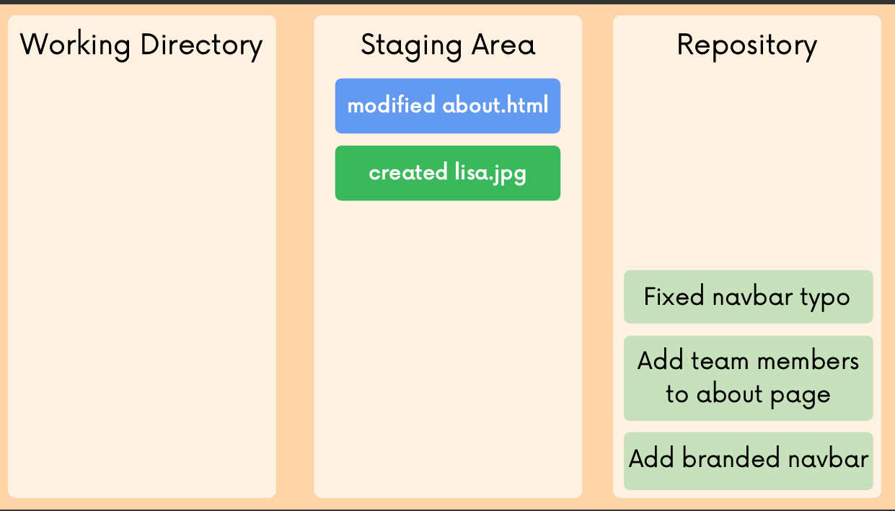
</p>


---

## 4. Viewing History (`git log`) (Module 04)

The default `git log` is often too verbose.

```bash
# Standard log (shows full hash, author, date, message)
git log

# The "One Line" Log (Essential for overview)
# Shows only the short hash and the title.
git log --oneline

# Limit the number of commits (e.g., last 2)
git log -2

# Show the log for a SPECIFIC file (History of just one file)
git log index.html

```

---

## 5. Commits in Detail (Module 05)

### Amending Commits (Fixing the previous commit)

**Scenario:** You committed, but you made a typo in the message, OR you forgot to add one file.

* **Warning:** Do **not** do this if you have already pushed the commit to GitHub. It rewrites history.

```bash
git commit -m ""

# 1. Make your changes (fix typo in file, add missing file)
git add forgotten_file.js

# 2. Add them to the previous commit (and optionally update the message)
git commit --amend

```

<p align="center">
  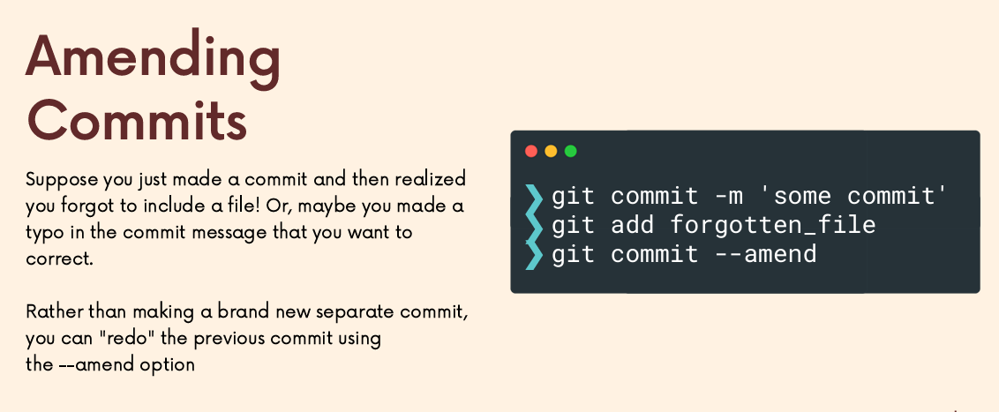
</p>

### Atomic Commits

* **Concept:** A commit should do **one thing**.
* **Why?** If you commit a "Bug Fix" and a "New Feature" together, and the "New Feature" breaks the site, you can't easily undo *just* the feature without undoing the bug fix.

---

## 6. File Management: Deleting & Renaming (Module 05)

This is where beginners get stuck.

### Deleting Files (`rm`)

* **The "Unix" Way (Manual):**
1. Delete the file in your file explorer: `rm file.txt`
2. Tell Git you deleted it: `git add file.txt`
3. Commit.


* **The "Git" Way (Faster):**
Removes the file from the file system AND stages the deletion in one step.
```bash
git rm file.txt

```


### The "Cached" Delete (Crucial for `.gitignore`)

**Scenario:** You accidentally committed a huge video file or a secrets file. You want to keep the file on your computer, but stop Git from tracking it.

```bash
git rm --cached secret_config.json

```

### Renaming Files (`mv`)

* **The "Unix" Way:**
1. Rename file: `mv old.txt new.txt`
2. Git sees this as **Deleted `old.txt**` and **Created `new.txt**`.
3. You must `git add old.txt` (to delete) and `git add new.txt` (to create).


* **The "Git" Way:**
Git detects the rename immediately.
```bash
git mv old.txt new.txt

```


---

## 7. The `.gitignore` File (Module 05)

A text file named `.gitignore` in your project root tells Git what to **never** track.

**Common Patterns:**

```text
# Ignore specific file
secrets.json

# Ignore all files with an extension
*.log

# Ignore a folder (and everything inside it)
node_modules/

# Negate (Ignore everything BUT this file)
!important.log

```

* **Note:** If a file is *already* being tracked, adding it to `.gitignore` does nothing. You must use `git rm --cached <file>` first.
---


# Chapter 2: Branching & Merging (Modules 06–07)

## 1. The Branching Model (Module 06)

In many VCS tools (like SVN), branching is expensive (copying the whole folder). In Git, branching is **instant** and **cheap**.

* **Concept:** A branch is just a lightweight, movable pointer to a specific commit.
* **HEAD:** A pointer to the *current* branch you are looking at.

### Viewing Branches

```bash
# List local branches (Asterisk * indicates current branch)
git branch

# List ALL branches (Local + Remote refs like origin/main)
git branch -a

# View branches with last commit info (Very useful)
git branch -v

```

---

## 2. Creating & Switching (Module 06)

**Crucial Update:** In 2019, Git released version 2.23 introducing `git switch`. Before this, `git checkout` was used for everything (files, commits, branches). You should know both.

### Creating a Branch

This creates the pointer but does **not** switch you to it.

```bash
git branch <new-branch-name>

```

### Switching Branches

**The Modern Way (`switch`):**

```bash
# Switch to an existing branch
git switch <branch-name>

# Create AND Switch in one command (The one you will use 99% of the time)
git switch -c <new-branch-name>

```

**The Old School Way (`checkout`):**
You will see this in StackOverflow answers. It works exactly the same.

```bash
# Switch
git checkout <branch-name>

# Create and Switch
git checkout -b <new-branch-name>

```

> **Visual Reference:** **`001 06 - Working With Branches.pdf`** (Pages 50-53) details the split between the overloaded `checkout` command and the new, cleaner `switch` command.

<p align="center">
  
  
</p>

---

## 3. Managing Branches (CRUD) (Module 06)

Branches accumulate quickly. You need to clean them up.

### Renaming a Branch

```bash
# Rename the branch you are CURRENTLY on
git branch -m <new-name>

# Rename a specific branch (from anywhere)
git branch -m <old-name> <new-name>

```

### Deleting a Branch

Git protects you from accidental data loss.

```bash
# Safe Delete (Will FAIL if branch is not merged yet)
git branch -d <branch-name>

# Force Delete (Ignores warnings - "I know what I'm doing, kill it")
git branch -D <branch-name>

```

---

## 4. Merging Strategies (Module 07)

Merging is the act of combining two branches.
**Rule:** Always switch to the **receiver** branch first.

* "I want to merge `feature` into `main`"  Switch to `main`, then merge `feature`.

```bash
git switch main
git merge feature-login

```

### Scenario A: Fast-Forward Merge

**Condition:** `main` has not changed since you created `feature-login`.
**Result:** Git simply moves the `main` pointer forward to catch up.
**History:** Linear. No "Merge Commit" is created.

> **Visual Reference:** **`001 07 - Merging Branches, Oh Boy!.pdf`** (Page 7) visualizes the pointer simply sliding forward.

<p align="center">
  
</p>

### Scenario B: Merge Commit (3-Way Merge)

**Condition:** `main` has new commits *and* `feature-login` has new commits. History has diverged.
**Result:** Git creates a **new commit** (Merge Commit) that has *two* parent commits.
**History:** Diamond shape (branch out, merge back in).

---

<p align="center">
  
</p>
## 5. Handling Merge Conflicts (Module 07)

Conflicts happen when the **same line** in the **same file** was edited differently in both branches. Git cannot guess which one is right.

### The Conflict Workflow

1. **Trigger:** You run `git merge feature`.
2. **Panic:** Git says `CONFLICT (content): Merge conflict in index.html`.
3. **Inspect:** Open the file. You will see markers:
```text
<<<<<<< HEAD
<h1>Header from Main Branch</h1>
=======
<h1>Header from Feature Branch</h1>
>>>>>>> feature

```


4. **Resolve:**
* Delete the `<<<<<<<`, `=======`, and `>>>>>>>` lines.
* Edit the code to look exactly how you want the final version to be.


5. **Finalize:**
```bash
git add index.html
git commit  # No -m needed; Git provides a default "Merge branch..." message

```


> **Visual Reference:** **`001 07 - Merging Branches, Oh Boy!.pdf`** (Pages 18-19) explicitly labels the "Current Change" (HEAD) and "Incoming Change" sections between the markers.

<p align="center">
  
  
</p>

---

# Chapter 3: Inspection, Stashing & Undoing (Modules 08–10)

## 1. Comparing Changes: `git diff` (Module 08)

`git status` tells you *which* files changed. `git diff` tells you *what lines* changed.

### The 4 Levels of Diff

1. **Working Directory vs. Staging Area (Default)**
"What have I typed but not yet staged?"
```bash
git diff

```


2. **Staging Area vs. Repository (Staged)**
"What have I staged that is about to be committed?"
**Critical:** You should always run this before `git commit`.
```bash
git diff --staged
# OR
git diff --cached

```


3. **Working Directory vs. Repository (All Changes)**
"What have I changed since the last commit (staged OR unstaged)?"
```bash
git diff HEAD

```
4. **Branch 1 vs Branch 2 / Commit 1 vs Commit 2**

```bash
git diff branch1..branch2
git diff commit1..commit2
```


### Visualizing the Output

* **Minus (`-`)**: Red text. Lines removed.
* **Plus (`+`)**: Green text. Lines added.
* **Header (`@@ -22,6 +22,10 @@`)**: Shows the line numbers where the change happened.

<p align="center">
  
  
</p>

<p align="center">
  
  
</p>

---

## 2. Context Switching: Stashing (Module 09)

**Problem:** You are on `feature-A` with messy, broken code. Your boss says, "Fix this bug on `main` NOW."

* You can't switch branches because Git says, "Your local changes would be overwritten."
* You don't want to commit broken code.

**Solution:** The Stash (a temporary clipboard for your changes).

### Basic Stashing

```bash
# 1. Save changes to the stash stack and revert working dir to last clean commit
git stash

# 2. (Optional) Stash with a name so you remember what it is
git stash save "work in progress on login"

```

### Retrieving Stashes

```bash
# Apply the most recent stash and REMOVE it from the stack
git stash pop

# Apply the most recent stash but KEEP it in the stack (Safer)
git stash apply

```

### Managing Multiple Stashes

Stashes form a stack (LIFO - Last In, First Out).

```bash
# List all stashes
git stash list
# Output:
# stash@{0}: WIP on master: ...
# stash@{1}: WIP on feature: ...

# Apply a specific stash (e.g., number 2)
git stash apply stash@{2}

# Delete a specific stash
git stash drop stash@{0}

# Clear ALL stashes (Careful!)
git stash clear

```

<p align="center">
  
  
</p>

<p align="center">
  
  
</p>

<p align="center">
  
  
</p>

---

## 3. Undoing Changes & Time Travel (Module 10)

This is the most dangerous and powerful part of Git. We must distinguish between **Private** (Local) and **Public** (Shared) history.

### A. Undoing **Uncommitted Changes** (File Level)

"I messed up this file, just set it back to how it was in the last commit."

**The Modern Command (`restore`):**

```bash
# Restore working directory file (Unstage changes)
git restore <filename>

# Unstage a file (Remove from Staging Area, keep in Working Dir)
git restore --staged <filename>

```

**The Old Command (`checkout`):**

```bash
git checkout <filename>

```

### B. Undoing **Local Commits** (`reset`)

"I committed the wrong thing, but I **haven't pushed** yet."

`git reset` moves the HEAD pointer backward.

<p align="center">
  
</p>


1. **Soft Reset (`--soft`)**:
* Moves HEAD back.
* **Keeps changes in Staging Area.**
* *Use case:* "I forgot one file in the last commit. Undo commit, add file, commit again."


```bash
    git reset --soft HEAD~1

```


2. **Mixed Reset (Default)**:
* Moves HEAD back.
* **Moves changes to Working Directory (Unstaged).**
* *Use case:* "I want to keep my work but rethink how I group the commits."


```bash
    git reset HEAD~1

```
<p align="center">
  
  
</p>

<p align="center">
  
  
</p>

3. **Hard Reset (`--hard`)**:
* Moves HEAD back.
* **DESTROYS ALL CHANGES.**
* *Use case:* "I totally messed up. Scrap everything since the last commit."


```bash
    git reset --hard HEAD~1

```

<p align="center">
  
  
</p>


### C. Undoing **Public Commits** (`revert`)

"I pushed a bug to `main` and my team has already pulled it."

* **NEVER use `reset` on public branches.** It rewrites history and breaks your teammates' repos.
* **Use `revert`.**

`git revert` creates a **NEW commit** that is the exact mathematical opposite of the bad commit.

```bash
git revert <commit-hash>

```

* Git will open the editor for a message (default: "Revert 'Fix bug'").
* History moves *forward*, not backward.


<p align="center">
  
  
</p>

---


# Chapter 4: Collaboration & Remote Workflows (Modules 11–14)

## 1. Remote Basics (Module 11)

A **Remote** is simply a URL to another copy of your repository (usually on GitHub/GitLab).

### Managing Remotes

When you clone, Git automatically creates a remote named `origin`.

```bash
# View current remotes (Name and URL)
git remote -v

# Add a new remote (e.g., pointing to a coworker's fork)
git remote add <name> <url>
# Example: git remote add upstream https://github.com/facebook/react.git

# Remove a remote (Deletes the bookmark, NOT the actual repo on the server)
git remote remove <name>

# Rename a remote
git remote rename <old-name> <new-name>

```

### Pushing Code

Pushing sends your *committed* changes to the remote.

```bash
# Standard Push (Send 'feature' branch to 'origin' remote)
git push origin feature

# First time push (Set Upstream)
# The -u flag links your local branch to the remote branch forever.
# Next time, you can just type 'git push'.
git push -u origin feature

```

> **Visual Reference:** **`001 11 - Github The Basics.pdf`** (Pages 60-61) shows the flow of pushing a local branch (`newfeature`) up to the remote (`origin`) so it exists on GitHub.

<p align="center">
  
  
</p>

---

## 2. Fetching vs. Pulling (Module 12)

This is the #1 source of confusion. You must understand the difference to avoid breaking things.

### The Tracking Branch (`origin/main`)

Git keeps a local, read-only copy of what the server looks like. These are called **Remote Tracking Branches**.

* You cannot edit them directly.
* They only update when you talk to the server (`fetch` or `pull`).

### `git fetch` (The Safe Option)

Downloads new data (commits, branches) from the remote but **does not touch your working code**.

* It updates `origin/main` to match the server.
* Your local `main` stays exactly where it was.

```bash
git fetch origin

```

### `git pull` (The Active Option)

It does two things in one command:

1. `git fetch` (Update the tracking branch)
2. `git merge` (Merge that tracking branch into your current local branch)

```bash
git pull origin main

```

* **Risk:** If you have uncommitted changes, `git pull` might fail or cause messy conflicts.

<p align="center">
  
</p>

---

## 3. Collaboration Workflows (Module 14)

How do teams actually work together without overwriting each other's code?

### A. Centralized Workflow (Small Teams)

* Everyone clones the same repo.
* Everyone pushes/pulls directly to `main`.
* **Problem:** Conflict hell if two people edit the same file at the same time.

### B. Feature Branch Workflow (Standard)

1. **Pull** latest `main`.
2. **Create** a new branch `feature-login`.
3. **Work** and Commit.
4. **Push** `feature-login` to GitHub.
5. **Open Pull Request (PR):** Discuss the code on GitHub.
6. **Merge** PR into `main` (on GitHub).
7. **Pull** `main` locally to get your own merged work back.

<p align="center">
  
  
</p>
<p align="center">
  
  
</p>
<p align="center">
  
  
  
</p>

### C. Forking Workflow (Open Source)

You don't have permission to push to the main repo (e.g., React or Linux).

1. **Fork** the repo on GitHub (creates a copy in *your* account).
2. **Clone** *your* fork.
3. **Add Upstream Remote** (link to the original repo).
```bash
    git remote add upstream https://github.com/original/repo.git

```


4. **Syncing:**
* Pull from `upstream` (Original) to keep your local repo fresh.
* Push to `origin` (Your Fork).
* Open PR from `origin` to `upstream`.

<p align="center">
  
  
  
</p>

---

## 4. GitHub "Odds & Ends" (Module 13)

Useful tools that live on GitHub, not Git.

### GitHub Pages

Host a static website (HTML/CSS/JS) directly from your repo for free.

* **User Site:** Create a repo named `username.github.io`. It publishes automatically.
* **Project Site:** Go to Repo Settings  Pages  Select Branch. URL will be `username.github.io/repo-name`.

### Gists

Instant way to share a single code file without creating a whole repo.

* **Public:** Searchable.
* **Secret:** Only accessible via link (not truly private, just unlisted).

### Markdown (README.md)

The front page of your repo.

* `# Heading`
* `**Bold**`
* ``Code Block``
* `[Link Text](url)`

---

# Chapter 5: Advanced Mechanics & Productivity (Modules 15–20)

## 1. Rebasing: The "Clean History" Tool (Module 15)

Rebasing solves the same problem as Merging (combining branches), but the result looks different.

### The Golden Rule

> **NEVER rebase a branch that you have shared with others (pushed to GitHub).**
> Only rebase your local, private feature branches.

### Rebase vs. Merge

* **Merge:** "True history." Shows exactly when branches split and rejoined. Safe. Result: A diamond shape in the graph.
* **Rebase:** "Linear history." Moves your work to the tip of the target branch. Destructive (rewrites commit hashes). Result: A straight line.

**Scenario:** `main` has moved forward while you were working on `feature`.

```bash
# 1. Switch to your feature branch
git switch feature

# 2. Rebase onto main (Move my work to start AFTER the latest main commit)
git rebase main

```

* If conflicts occur: Fix files  `git add`  `git rebase --continue`.

> **Visual Reference:** **`001 15 - Rebasing The Scariest Git Command.pdf`** (Page 2) shows the "messy" merge history vs. the "clean" rebase history.
<p align="center">
  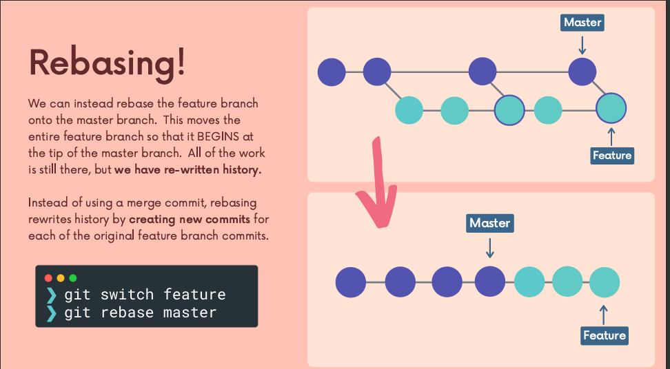
</p>
---

## 2. Interactive Rebase: "Photoshop for Commits" (Module 16)

This is how you clean up your "Work in Progress" mess before merging.

**Command:**

```bash
# Edit the last 4 commits
git rebase -i HEAD~4

```

**The Menu:**
Git opens a text editor with a list of commits. Change the word `pick` to one of these:

* **`pick`**: Keep the commit as is.
* **`reword`**: Keep the code, but change the commit message.
* **`edit`**: Pause here to change the *content* of the commit (add/remove files).
* **`squash`**: Meld this commit into the previous one (combine 3 small commits into 1 big one).
* **`drop`**: Delete this commit entirely.

> **Visual Reference:** **`001 16 - Cleaning Up History...pdf`** (Page 24) shows the interactive editor interface where you select `pick`, `squash`, etc.
<p align="center">
  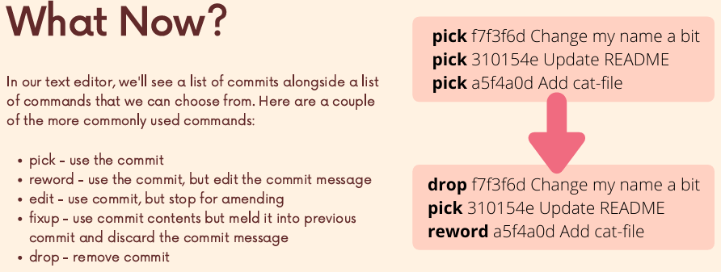
</p>
---

## 3. Tagging: Marking Releases (Module 17)

A **Branch** moves. A **Tag** stays still. Use tags for production releases (e.g., v1.0).

### Creating Tags

* **Lightweight Tag:** Just a bookmark.
```bash
git tag v1.0

```

* **Annotated Tag (Professional Standard):** Stores author, date, and message.
```bash
git tag -a v1.0 -m "First Public Release"

```

### Commom commands
```bash
git tag  # View Tag
git checkout <tag>  # Checkout Tag
git tag -d <tagname> # Delete Tag
```

### Pushing Tags

Tags are **not** pushed by default. You must be explicit.

```bash
# Push specific tag
git push origin v1.0

# Push ALL tags
git push origin --tags

```

> **Visual Reference:** **`001 17 - Git Tags...pdf`** (Pages 4-6) visualizes tags as permanent markers on specific commits, even as the branch moves forward.

<p align="center">
  
  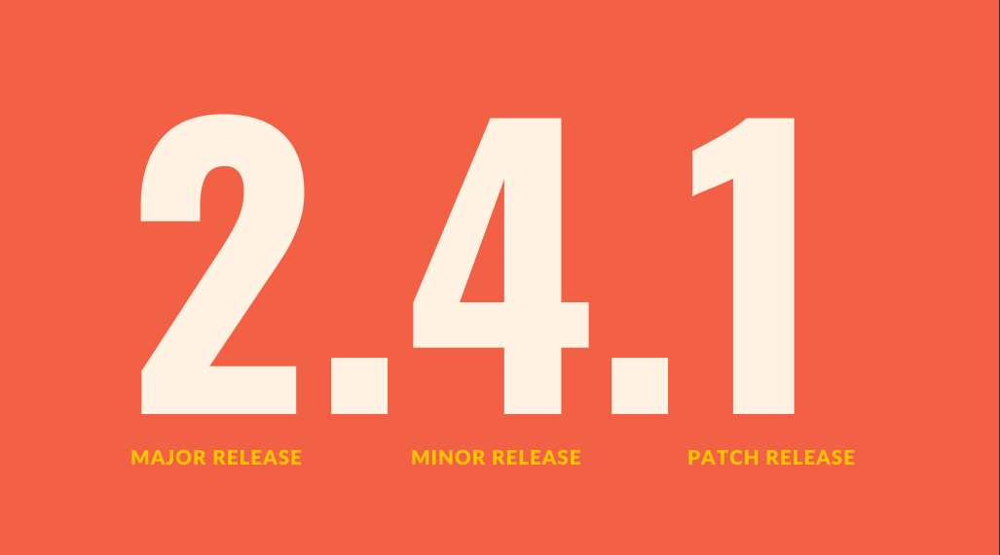
</p>

---

## 4. Git Internals: Hashing & Objects (Module 18)

Understanding this demystifies Git. It's not magic; it's a database.

### The Object Database (Key-Value Store)

Everything in Git is hashed using **SHA-1** (a 40-character string). The **Hash** is the Key; the **Data** is the Value.

### The 3 Main Objects

1. **Blob (Binary Large Object):** The content of a file. (Git doesn't store filenames here, just the text inside).
2. **Tree:** A directory listing. It maps filenames to Blobs (or other Trees).
3. **Commit:** A wrapper object. It points to a **Tree** (the root folder of your project) and adds metadata (Author, Parent Commit, Message).

> **Visual Reference:** **`001 18 - Git Behind The Scenes...pdf`** (Page 43) clearly diagrams the hierarchy: **Commit**  **Tree**  **Blob**.

<p align="center">
  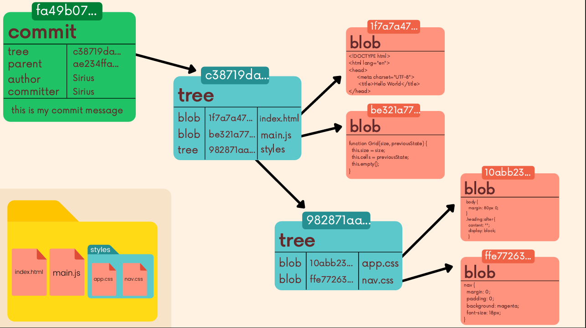
  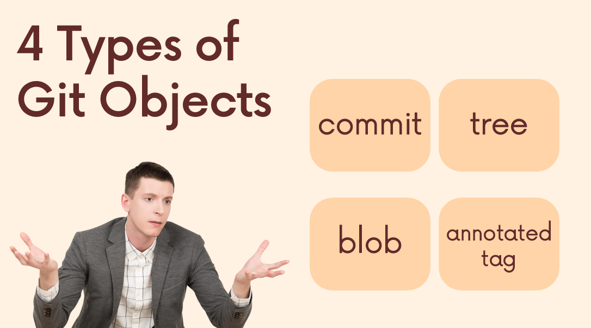
</p>

<p align="center">
  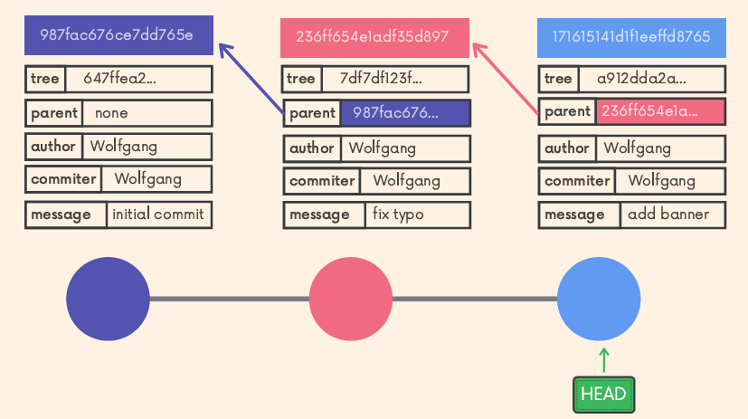
</p>

---

## 5. Reflogs: The Safety Net (Module 19)

If you deleted a branch or did a hard reset and lost code, **Reflog** is your backup.
Git records *every* time the HEAD pointer moves.

```bash
# View the movement history
git reflog
# Output:
# e4d909 HEAD@{0}: reset: moving to HEAD~1
# 8a2b12 HEAD@{1}: commit: add login feature

```

**Recovery:**
To go back to the state *before* you messed up (e.g., index 1):

```bash
git reset --hard HEAD@{1}

```

**Limitations:**
reflogs are kept on your local activity and not shared with collaborators. Reflogs also **expire**. Git cleans out old entries after **around 90 days**, though this can be configured 

> **Visual Reference:** **`001 19 - The Power of Reflogs...pdf`** (Page 9) shows the list of "breadcrumbs" Git leaves behind for every action.

<p align="center">
  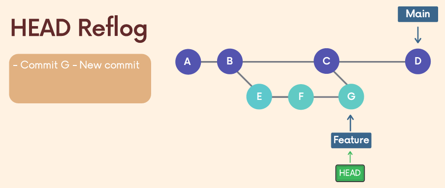
  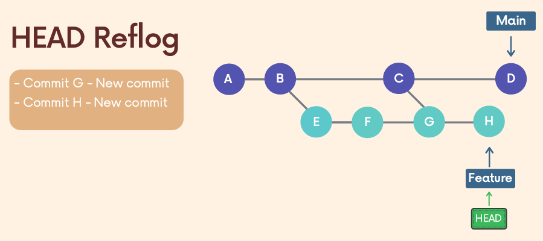
</p>

---

## 6. Custom Aliases (Module 20)

Type less, do more.

**Setting up Shortcuts:**

```bash
# 'git s' = 'git status'
git config --global alias.s status

# 'git cm' = 'git commit -m'
git config --global alias.cm "commit -m"

# 'git l' = A beautiful, colored graph log (The "Pro" Log)
git config --global alias.l "log --oneline --graph --decorate --all"

```

> **Visual Reference:** **`001 20 - Writing Custom Git Aliases.pdf`** (Page 3) shows the `.gitconfig` file structure where these aliases are saved.

<p align="center">
  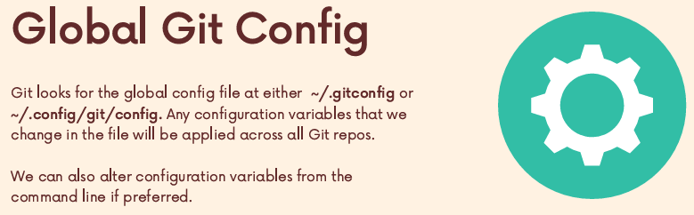
  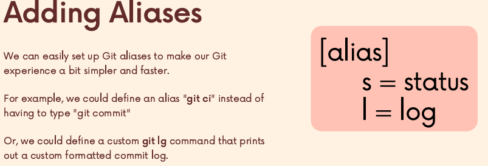
</p>

---

# Course Complete.

You now have the full content:

* **Chapter 1:** Basics (Setup, Add, Commit).
* **Chapter 2:** Branching & Merging (Switch, Merge, Conflicts).
* **Chapter 3:** The "Oh No" Toolkit (Diff, Stash, Reset, Revert).
* **Chapter 4:** Collaboration (Remotes, Fetch vs Pull, PRs).
* **Chapter 5:** Advanced (Rebase, Tags, Internals, Reflog).
