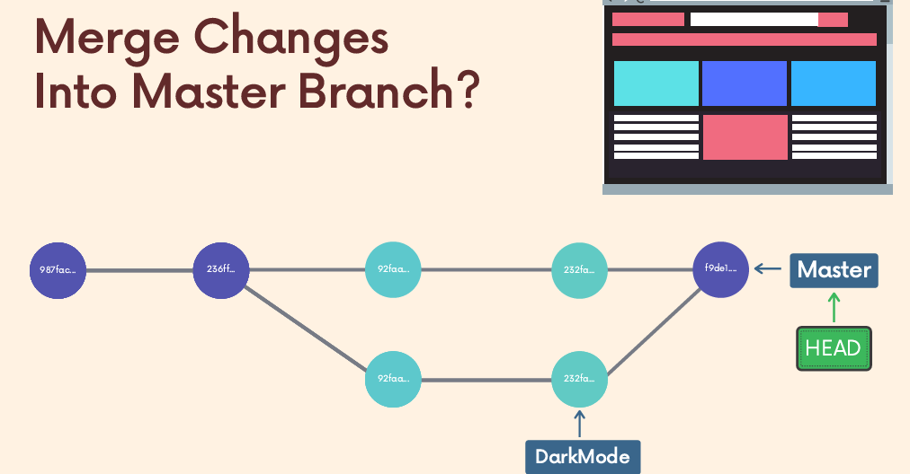
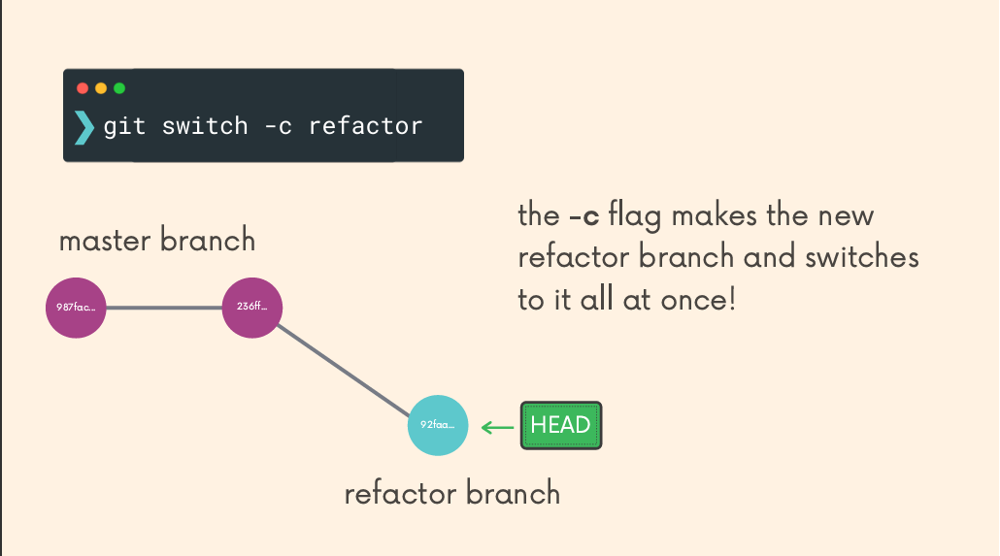
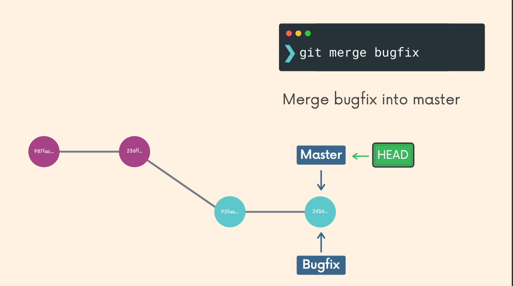
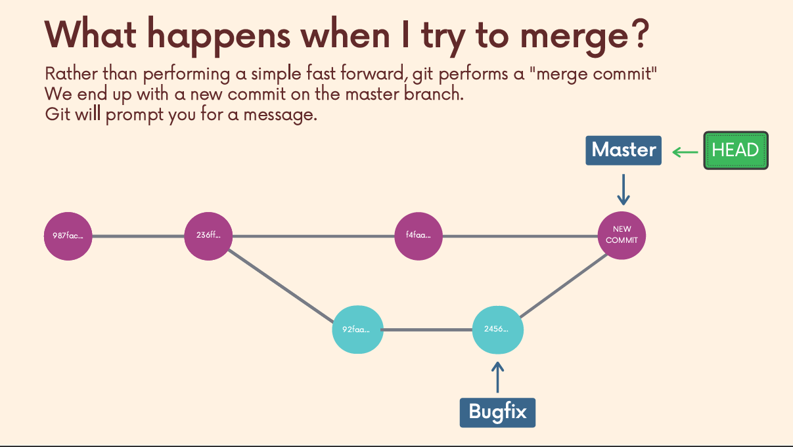
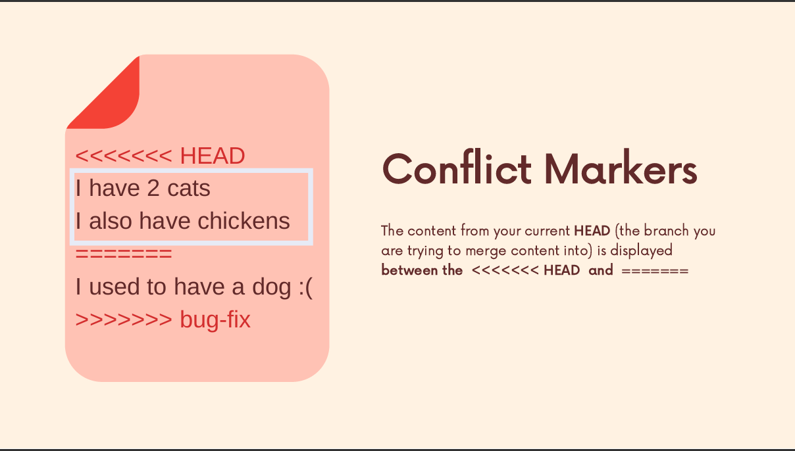
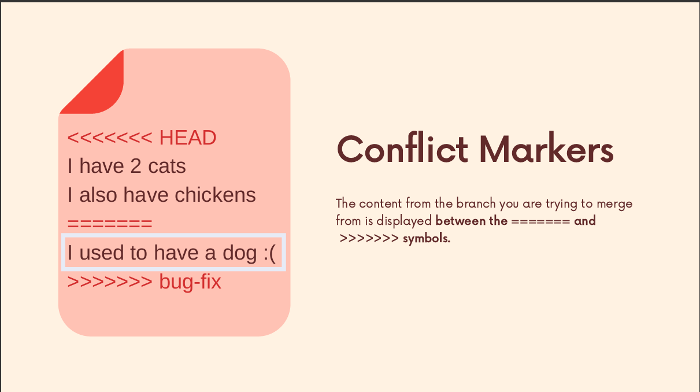

# Chapter 2: Branching & Merging (Modules 06–07)

## 1. The Branching Model (Module 06)

In many VCS tools (like SVN), branching is expensive (copying the whole folder). In Git, branching is **instant** and **cheap**.

* **Concept:** A branch is just a lightweight, movable pointer to a specific commit.
* **HEAD:** A pointer to the *current* branch you are looking at.

### Viewing Branches

```bash
# List local branches (Asterisk * indicates current branch)
git branch

# List ALL branches (Local + Remote refs like origin/main)
git branch -a

# View branches with last commit info (Very useful)
git branch -v

```

---

## 2. Creating & Switching (Module 06)

**Crucial Update:** In 2019, Git released version 2.23 introducing `git switch`. Before this, `git checkout` was used for everything (files, commits, branches). You should know both.

### Creating a Branch

This creates the pointer but does **not** switch you to it.

```bash
git branch <new-branch-name>

```

### Switching Branches

**The Modern Way (`switch`):**

```bash
# Switch to an existing branch
git switch <branch-name>

# Create AND Switch in one command (The one you will use 99% of the time)
git switch -c <new-branch-name>

```

**The Old School Way (`checkout`):**
You will see this in StackOverflow answers. It works exactly the same.

```bash
# Switch
git checkout <branch-name>

# Create and Switch
git checkout -b <new-branch-name>

```

> **Visual Reference:** **`001 06 - Working With Branches.pdf`** (Pages 50-53) details the split between the overloaded `checkout` command and the new, cleaner `switch` command.

<p align="center">
  
  
</p>

---

## 3. Managing Branches (CRUD) (Module 06)

Branches accumulate quickly. You need to clean them up.

### Renaming a Branch

```bash
# Rename the branch you are CURRENTLY on
git branch -m <new-name>

# Rename a specific branch (from anywhere)
git branch -m <old-name> <new-name>

```

### Deleting a Branch

Git protects you from accidental data loss.

```bash
# Safe Delete (Will FAIL if branch is not merged yet)
git branch -d <branch-name>

# Force Delete (Ignores warnings - "I know what I'm doing, kill it")
git branch -D <branch-name>

```

---

## 4. Merging Strategies (Module 07)

Merging is the act of combining two branches.
**Rule:** Always switch to the **receiver** branch first.

* "I want to merge `feature` into `main`"  Switch to `main`, then merge `feature`.

```bash
git switch main
git merge feature-login

```

### Scenario A: Fast-Forward Merge

**Condition:** `main` has not changed since you created `feature-login`.
**Result:** Git simply moves the `main` pointer forward to catch up.
**History:** Linear. No "Merge Commit" is created.

> **Visual Reference:** **`001 07 - Merging Branches, Oh Boy!.pdf`** (Page 7) visualizes the pointer simply sliding forward.

<p align="center">
  
</p>

### Scenario B: Merge Commit (3-Way Merge)

**Condition:** `main` has new commits *and* `feature-login` has new commits. History has diverged.
**Result:** Git creates a **new commit** (Merge Commit) that has *two* parent commits.
**History:** Diamond shape (branch out, merge back in).

---

<p align="center">
  
</p>
## 5. Handling Merge Conflicts (Module 07)

Conflicts happen when the **same line** in the **same file** was edited differently in both branches. Git cannot guess which one is right.

### The Conflict Workflow

1. **Trigger:** You run `git merge feature`.
2. **Panic:** Git says `CONFLICT (content): Merge conflict in index.html`.
3. **Inspect:** Open the file. You will see markers:
```text
<<<<<<< HEAD
<h1>Header from Main Branch</h1>
=======
<h1>Header from Feature Branch</h1>
>>>>>>> feature

```


4. **Resolve:**
* Delete the `<<<<<<<`, `=======`, and `>>>>>>>` lines.
* Edit the code to look exactly how you want the final version to be.


5. **Finalize:**
```bash
git add index.html
git commit  # No -m needed; Git provides a default "Merge branch..." message

```


> **Visual Reference:** **`001 07 - Merging Branches, Oh Boy!.pdf`** (Pages 18-19) explicitly labels the "Current Change" (HEAD) and "Incoming Change" sections between the markers.

<p align="center">
  
  
</p>

---