# Chapter 3: Inspection, Stashing & Undoing (Modules 08–10)

## 1. Comparing Changes: `git diff` (Module 08)

`git status` tells you *which* files changed. `git diff` tells you *what lines* changed.

### The 4 Levels of Diff

1. **Working Directory vs. Staging Area (Default)**
"What have I typed but not yet staged?"
```bash
git diff

```


2. **Staging Area vs. Repository (Staged)**
"What have I staged that is about to be committed?"
**Critical:** You should always run this before `git commit`.
```bash
git diff --staged
# OR
git diff --cached

```


3. **Working Directory vs. Repository (All Changes)**
"What have I changed since the last commit (staged OR unstaged)?"
```bash
git diff HEAD

```
4. **Branch 1 vs Branch 2 / Commit 1 vs Commit 2**

```bash
git diff branch1..branch2
git diff commit1..commit2
```


### Visualizing the Output

* **Minus (`-`)**: Red text. Lines removed.
* **Plus (`+`)**: Green text. Lines added.
* **Header (`@@ -22,6 +22,10 @@`)**: Shows the line numbers where the change happened.

<p align="center">
  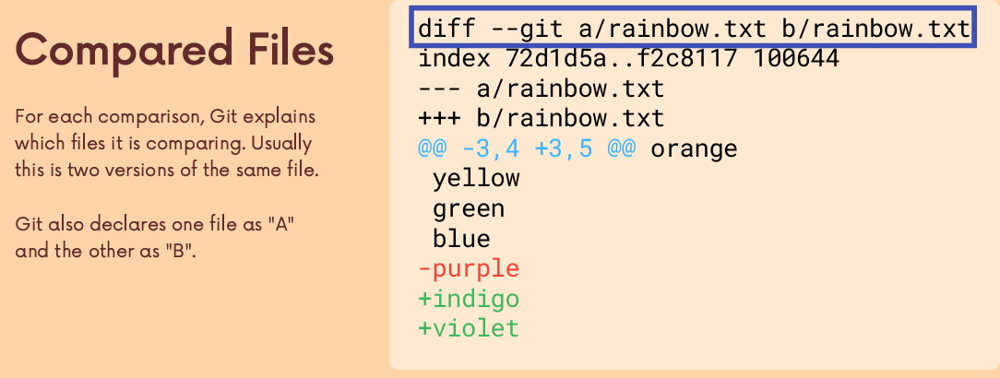
  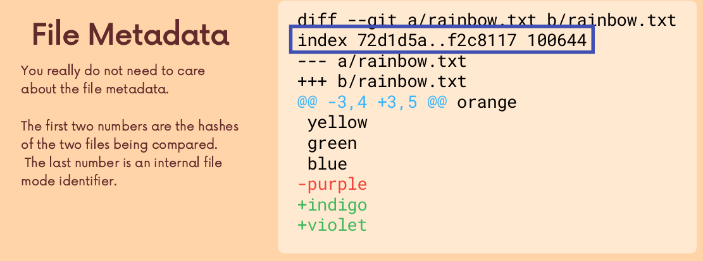
</p>

<p align="center">
  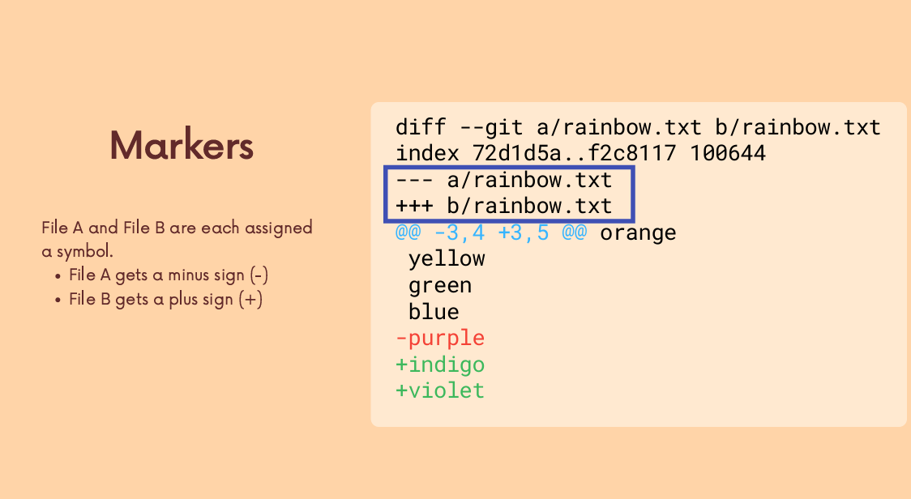
  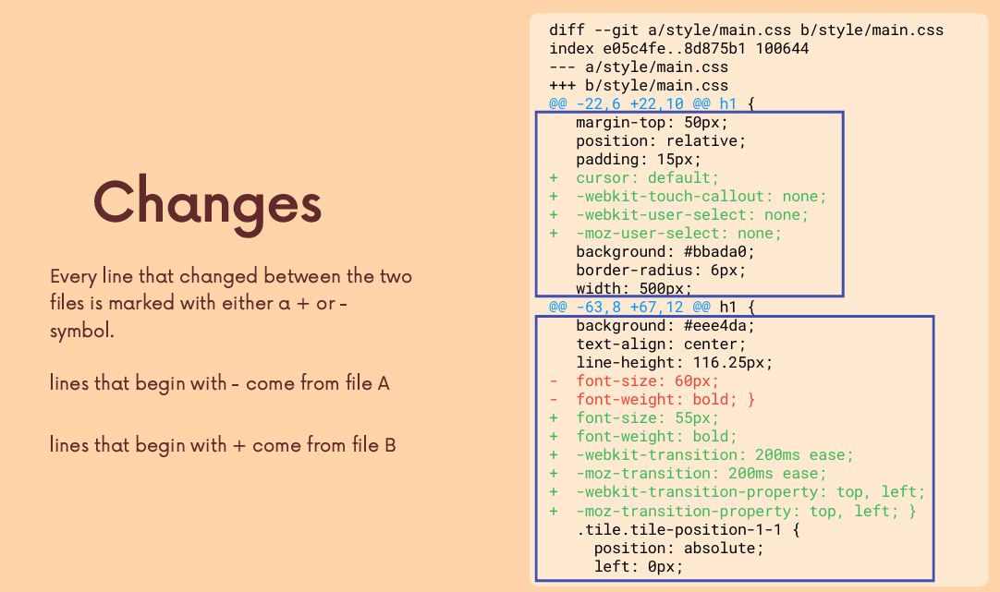
</p>

---

## 2. Context Switching: Stashing (Module 09)

**Problem:** You are on `feature-A` with messy, broken code. Your boss says, "Fix this bug on `main` NOW."

* You can't switch branches because Git says, "Your local changes would be overwritten."
* You don't want to commit broken code.

**Solution:** The Stash (a temporary clipboard for your changes).

### Basic Stashing

```bash
# 1. Save changes to the stash stack and revert working dir to last clean commit
git stash

# 2. (Optional) Stash with a name so you remember what it is
git stash save "work in progress on login"

```

### Retrieving Stashes

```bash
# Apply the most recent stash and REMOVE it from the stack
git stash pop

# Apply the most recent stash but KEEP it in the stack (Safer)
git stash apply

```

### Managing Multiple Stashes

Stashes form a stack (LIFO - Last In, First Out).

```bash
# List all stashes
git stash list
# Output:
# stash@{0}: WIP on master: ...
# stash@{1}: WIP on feature: ...

# Apply a specific stash (e.g., number 2)
git stash apply stash@{2}

# Delete a specific stash
git stash drop stash@{0}

# Clear ALL stashes (Careful!)
git stash clear

```

<p align="center">
  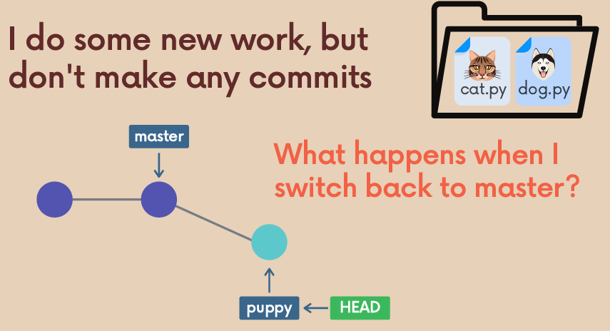
  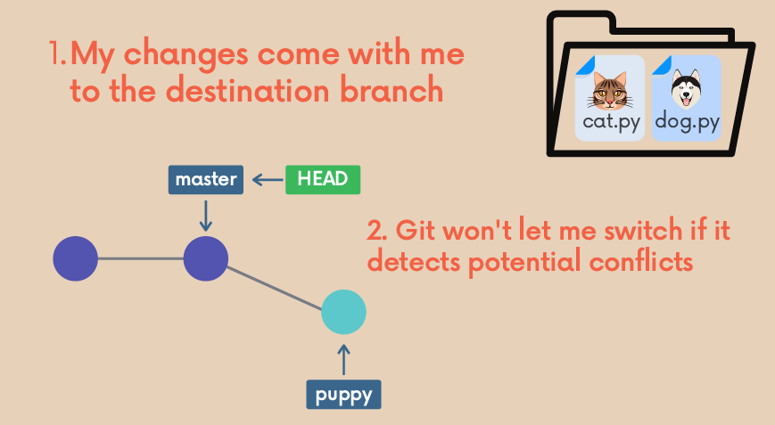
</p>

<p align="center">
  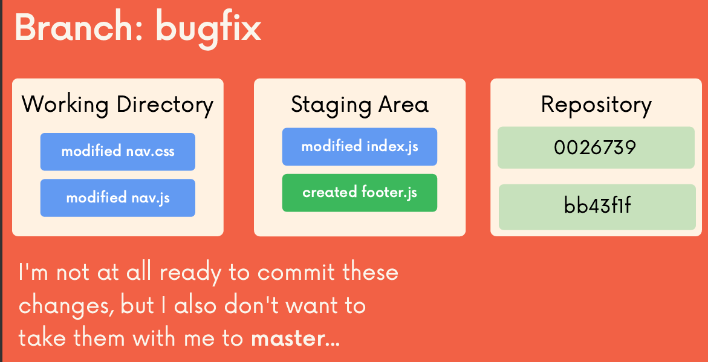
  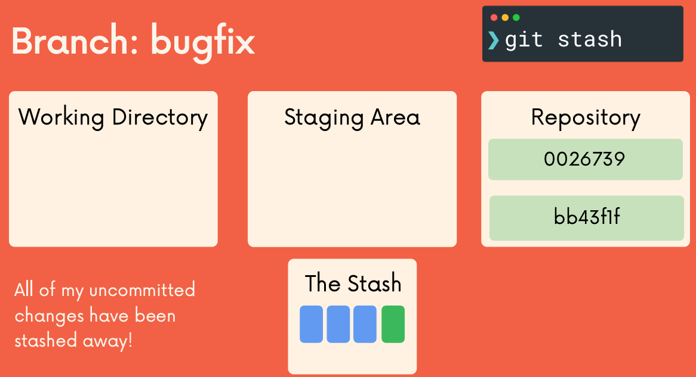
</p>

<p align="center">
  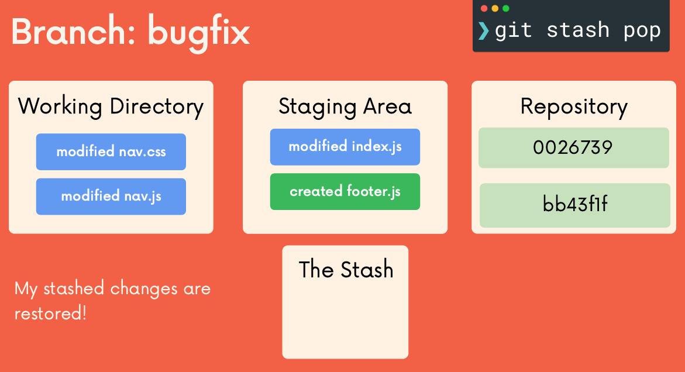
  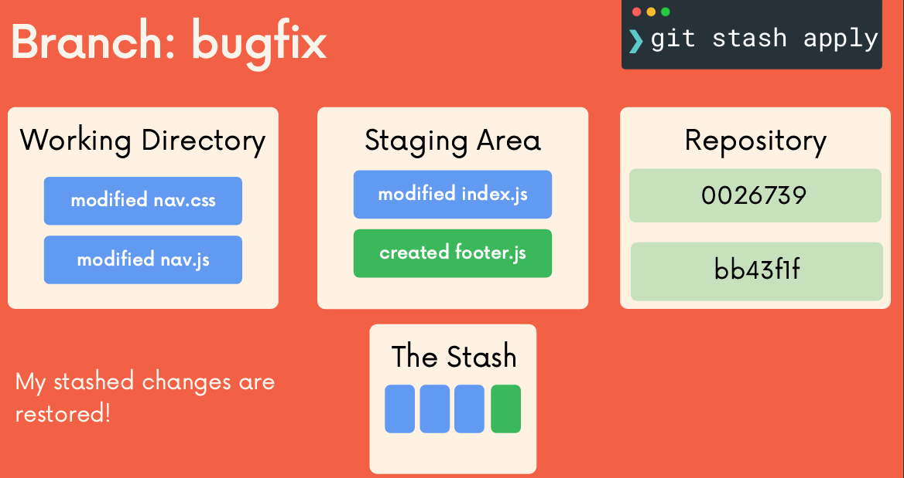
</p>

---

## 3. Undoing Changes & Time Travel (Module 10)

This is the most dangerous and powerful part of Git. We must distinguish between **Private** (Local) and **Public** (Shared) history.

### A. Undoing **Uncommitted Changes** (File Level)

"I messed up this file, just set it back to how it was in the last commit."

**The Modern Command (`restore`):**

```bash
# Restore working directory file (Unstage changes)
git restore <filename>

# Unstage a file (Remove from Staging Area, keep in Working Dir)
git restore --staged <filename>

```

**The Old Command (`checkout`):**

```bash
git checkout <filename>

```

### B. Undoing **Local Commits** (`reset`)

"I committed the wrong thing, but I **haven't pushed** yet."

`git reset` moves the HEAD pointer backward.

<p align="center">
  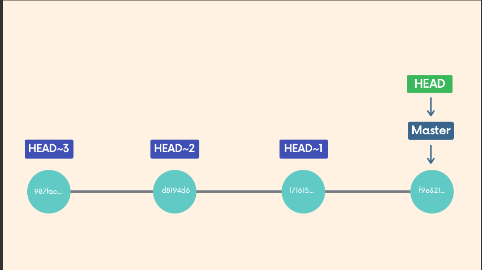
</p>


1. **Soft Reset (`--soft`)**:
* Moves HEAD back.
* **Keeps changes in Staging Area.**
* *Use case:* "I forgot one file in the last commit. Undo commit, add file, commit again."


```bash
    git reset --soft HEAD~1

```


2. **Mixed Reset (Default)**:
* Moves HEAD back.
* **Moves changes to Working Directory (Unstaged).**
* *Use case:* "I want to keep my work but rethink how I group the commits."


```bash
    git reset HEAD~1

```
<p align="center">
  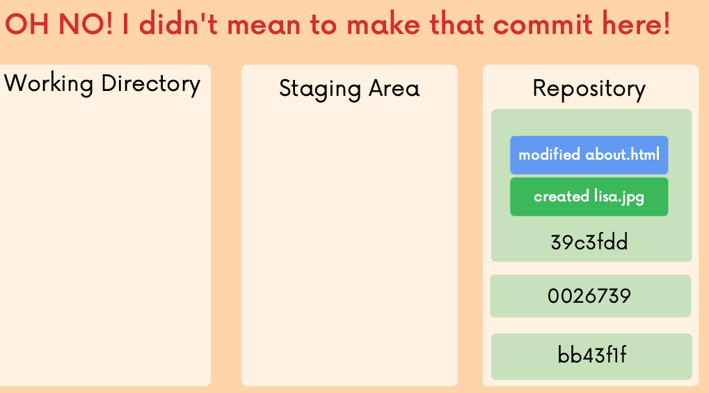
  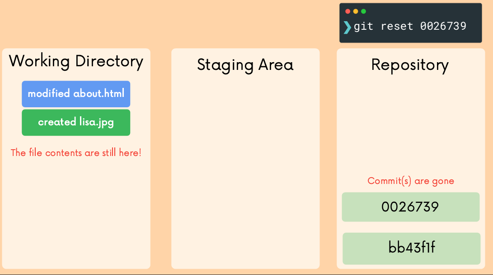
</p>

<p align="center">
  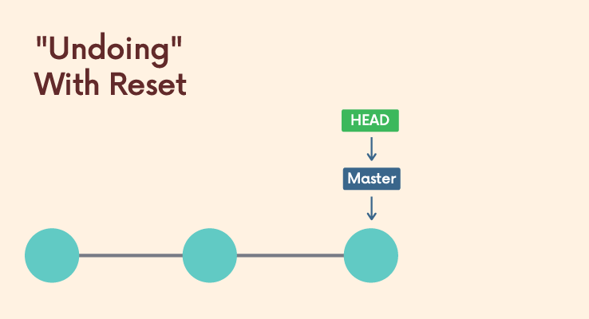
  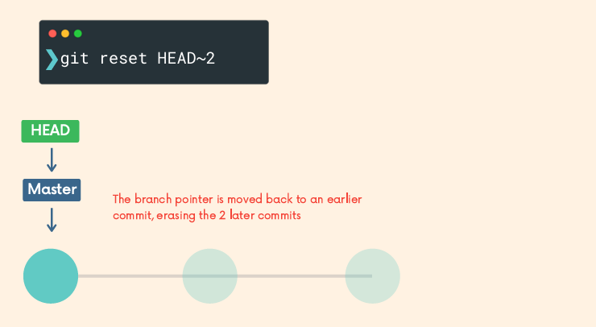
</p>

3. **Hard Reset (`--hard`)**:
* Moves HEAD back.
* **DESTROYS ALL CHANGES.**
* *Use case:* "I totally messed up. Scrap everything since the last commit."


```bash
    git reset --hard HEAD~1

```

<p align="center">
  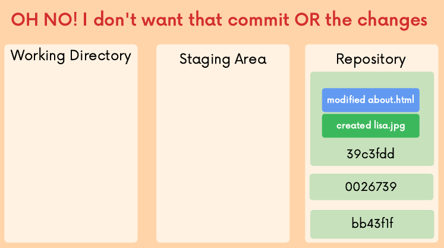
  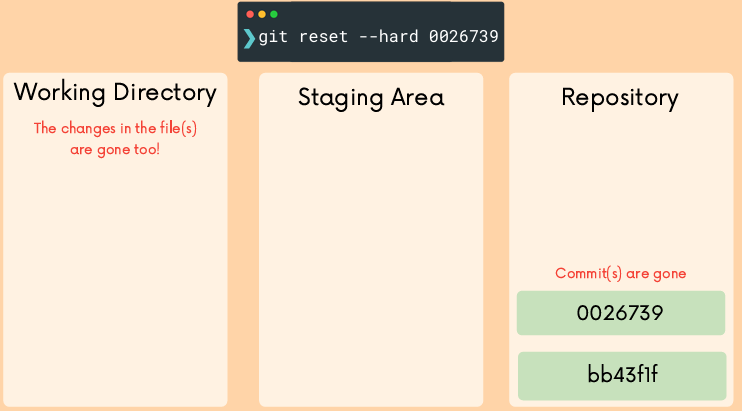
</p>


### C. Undoing **Public Commits** (`revert`)

"I pushed a bug to `main` and my team has already pulled it."

* **NEVER use `reset` on public branches.** It rewrites history and breaks your teammates' repos.
* **Use `revert`.**

`git revert` creates a **NEW commit** that is the exact mathematical opposite of the bad commit.

```bash
git revert <commit-hash>

```

* Git will open the editor for a message (default: "Revert 'Fix bug'").
* History moves *forward*, not backward.


<p align="center">
  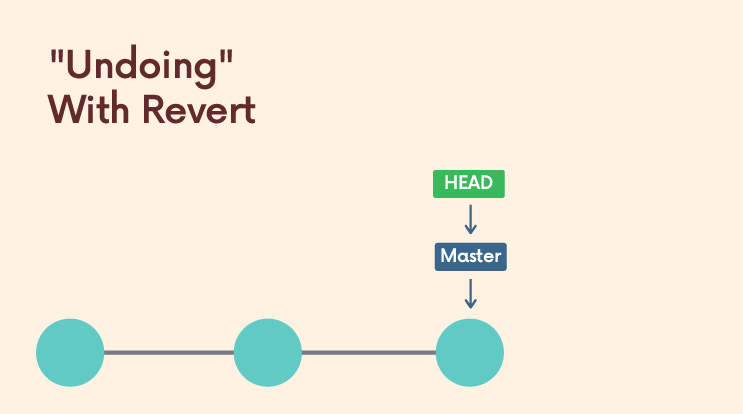
  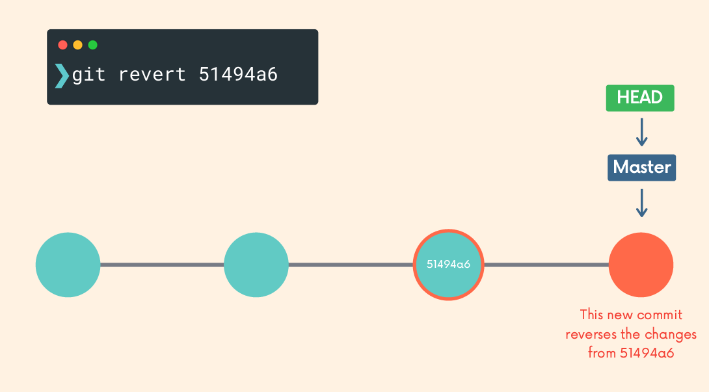
</p>

---