# Chapter 4: Collaboration & Remote Workflows (Modules 11–14)

## 1. Remote Basics (Module 11)

A **Remote** is simply a URL to another copy of your repository (usually on GitHub/GitLab).

### Managing Remotes

When you clone, Git automatically creates a remote named `origin`.

```bash
# View current remotes (Name and URL)
git remote -v

# Add a new remote (e.g., pointing to a coworker's fork)
git remote add <name> <url>
# Example: git remote add upstream https://github.com/facebook/react.git

# Remove a remote (Deletes the bookmark, NOT the actual repo on the server)
git remote remove <name>

# Rename a remote
git remote rename <old-name> <new-name>

```

### Pushing Code

Pushing sends your *committed* changes to the remote.

```bash
# Standard Push (Send 'feature' branch to 'origin' remote)
git push origin feature

# First time push (Set Upstream)
# The -u flag links your local branch to the remote branch forever.
# Next time, you can just type 'git push'.
git push -u origin feature

```

> **Visual Reference:** **`001 11 - Github The Basics.pdf`** (Pages 60-61) shows the flow of pushing a local branch (`newfeature`) up to the remote (`origin`) so it exists on GitHub.

<p align="center">
  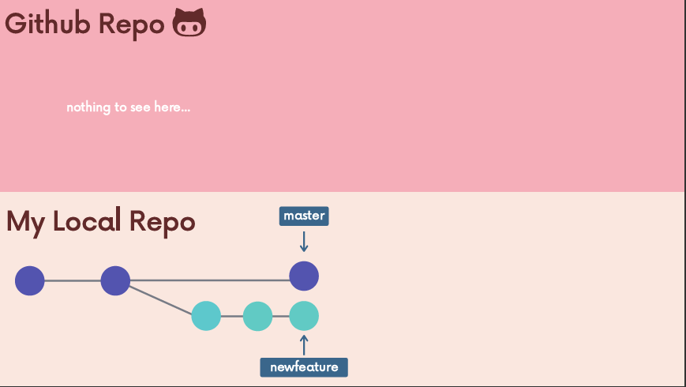
  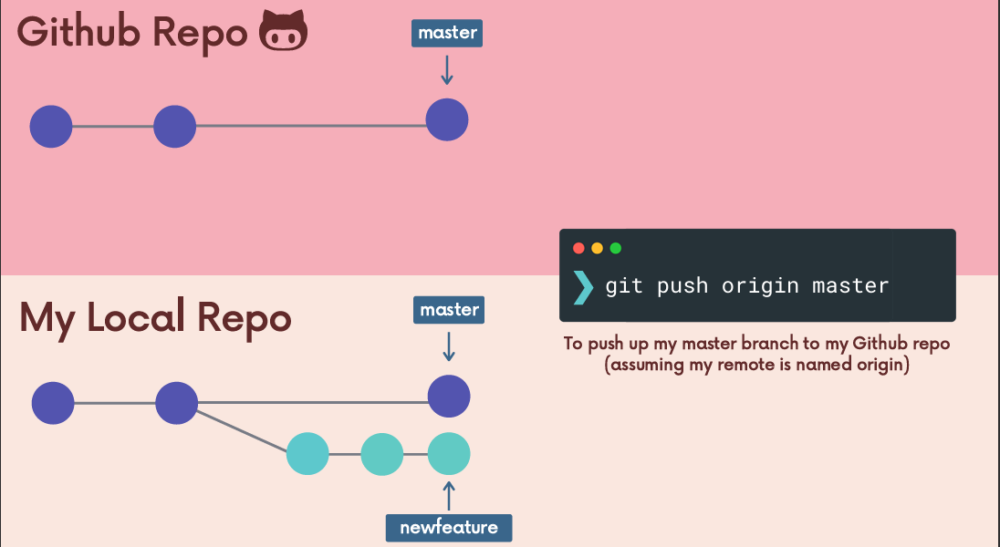
</p>

---

## 2. Fetching vs. Pulling (Module 12)

This is the #1 source of confusion. You must understand the difference to avoid breaking things.

### The Tracking Branch (`origin/main`)

Git keeps a local, read-only copy of what the server looks like. These are called **Remote Tracking Branches**.

* You cannot edit them directly.
* They only update when you talk to the server (`fetch` or `pull`).

### `git fetch` (The Safe Option)

Downloads new data (commits, branches) from the remote but **does not touch your working code**.

* It updates `origin/main` to match the server.
* Your local `main` stays exactly where it was.

```bash
git fetch origin

```

### `git pull` (The Active Option)

It does two things in one command:

1. `git fetch` (Update the tracking branch)
2. `git merge` (Merge that tracking branch into your current local branch)

```bash
git pull origin main

```

* **Risk:** If you have uncommitted changes, `git pull` might fail or cause messy conflicts.

<p align="center">
  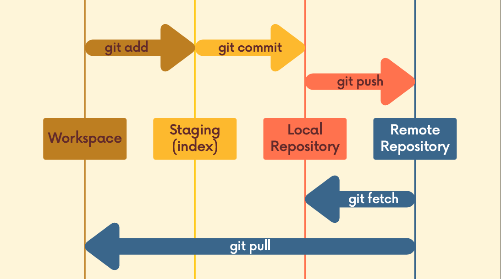
</p>

---

## 3. Collaboration Workflows (Module 14)

How do teams actually work together without overwriting each other's code?

### A. Centralized Workflow (Small Teams)

* Everyone clones the same repo.
* Everyone pushes/pulls directly to `main`.
* **Problem:** Conflict hell if two people edit the same file at the same time.

### B. Feature Branch Workflow (Standard)

1. **Pull** latest `main`.
2. **Create** a new branch `feature-login`.
3. **Work** and Commit.
4. **Push** `feature-login` to GitHub.
5. **Open Pull Request (PR):** Discuss the code on GitHub.
6. **Merge** PR into `main` (on GitHub).
7. **Pull** `main` locally to get your own merged work back.

<p align="center">
  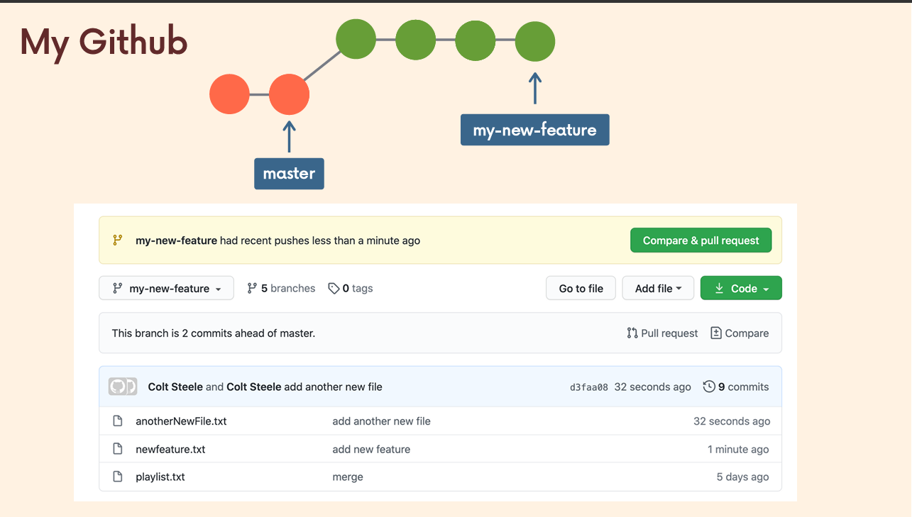
  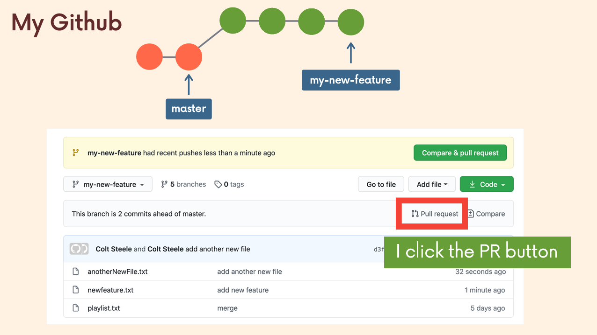
</p>
<p align="center">
  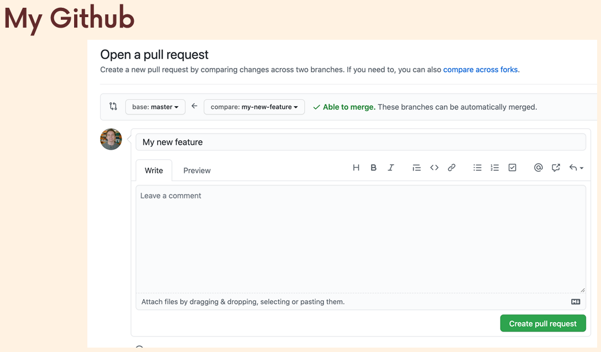
  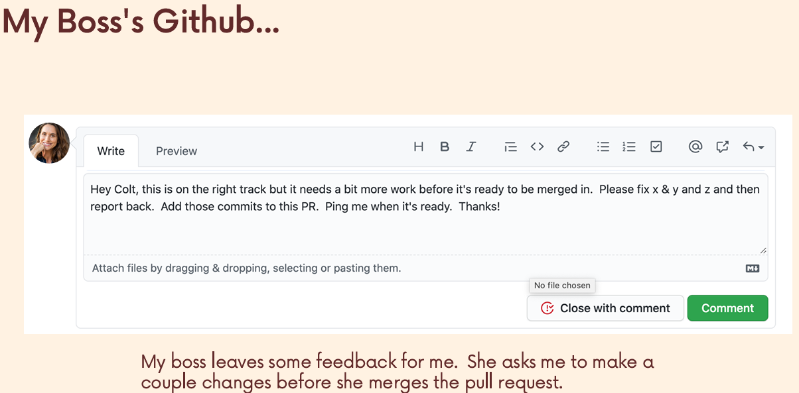
</p>
<p align="center">
  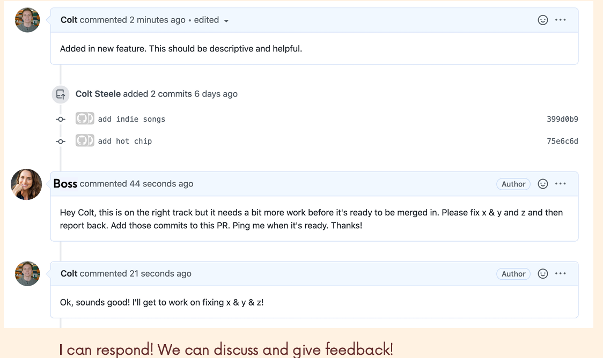
  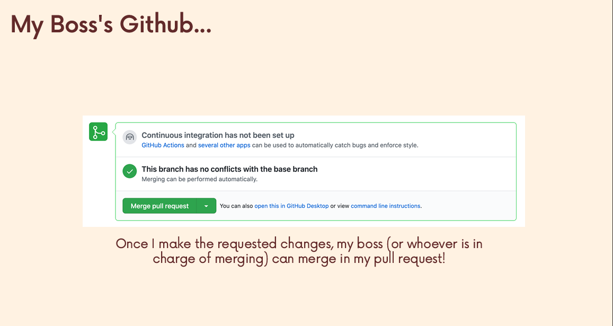
  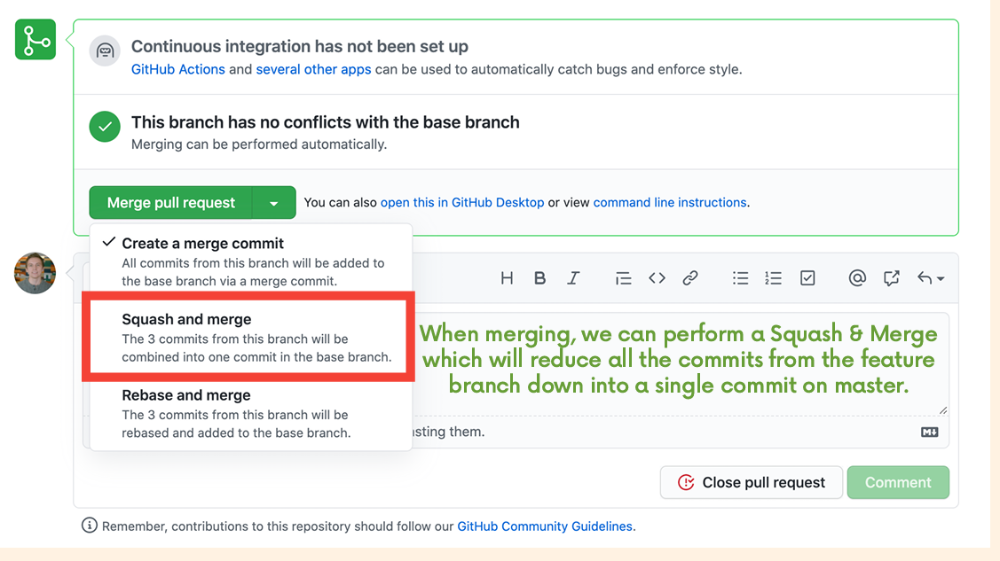
</p>

### C. Forking Workflow (Open Source)

You don't have permission to push to the main repo (e.g., React or Linux).

1. **Fork** the repo on GitHub (creates a copy in *your* account).
2. **Clone** *your* fork.
3. **Add Upstream Remote** (link to the original repo).
```bash
    git remote add upstream https://github.com/original/repo.git

```


4. **Syncing:**
* Pull from `upstream` (Original) to keep your local repo fresh.
* Push to `origin` (Your Fork).
* Open PR from `origin` to `upstream`.

<p align="center">
  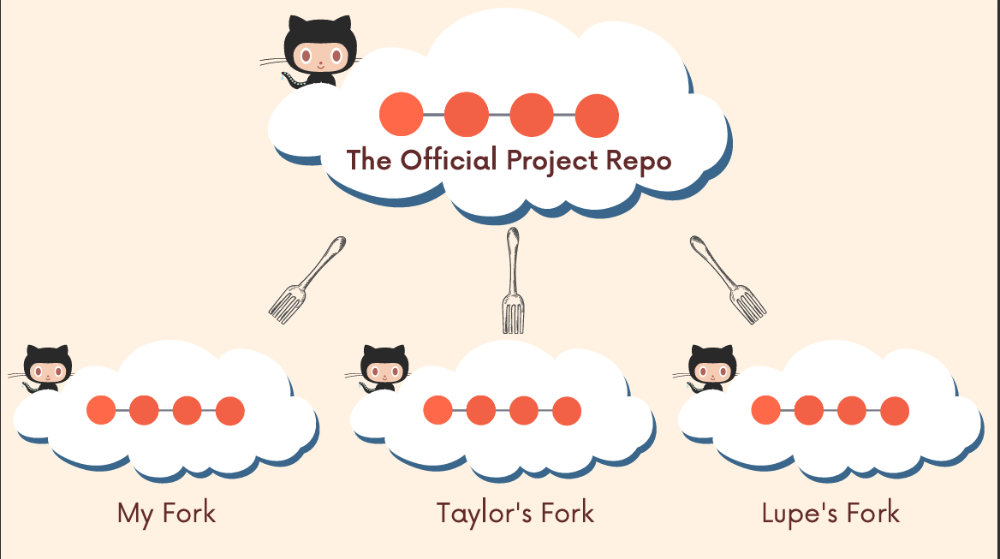
  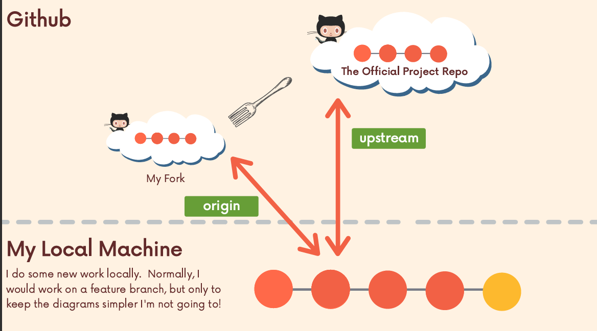
  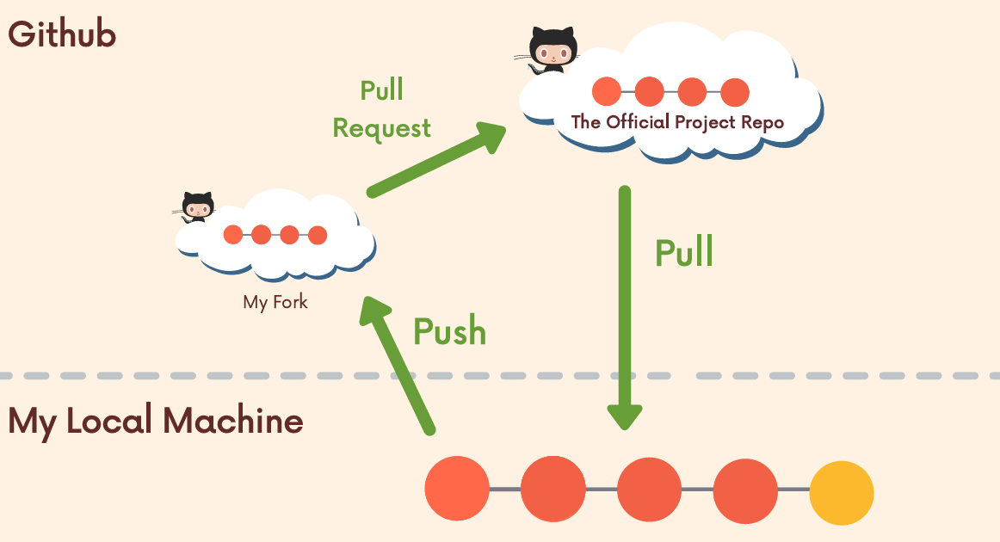
</p>

---

## 4. GitHub "Odds & Ends" (Module 13)

Useful tools that live on GitHub, not Git.

### GitHub Pages

Host a static website (HTML/CSS/JS) directly from your repo for free.

* **User Site:** Create a repo named `username.github.io`. It publishes automatically.
* **Project Site:** Go to Repo Settings  Pages  Select Branch. URL will be `username.github.io/repo-name`.

### Gists

Instant way to share a single code file without creating a whole repo.

* **Public:** Searchable.
* **Secret:** Only accessible via link (not truly private, just unlisted).

### Markdown (README.md)

The front page of your repo.

* `# Heading`
* `**Bold**`
* ``Code Block``
* `[Link Text](url)`

---